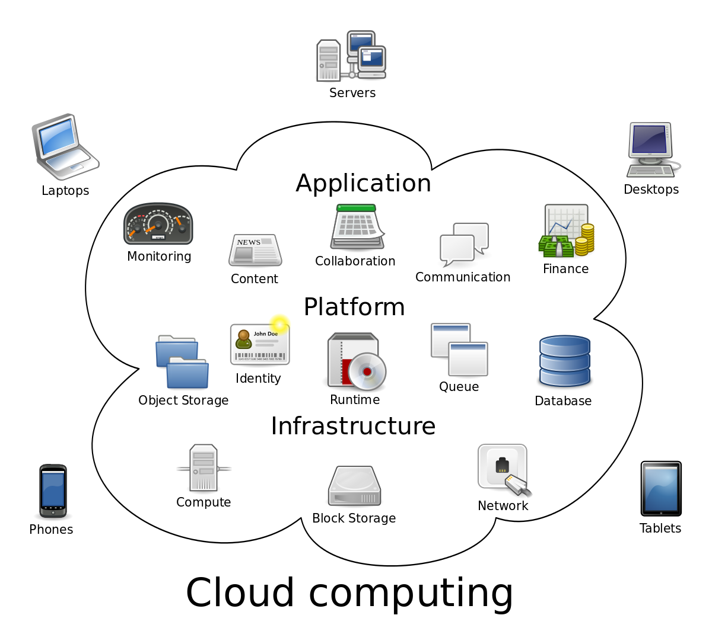
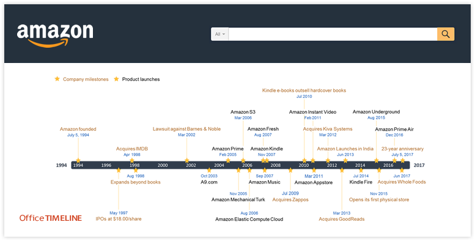
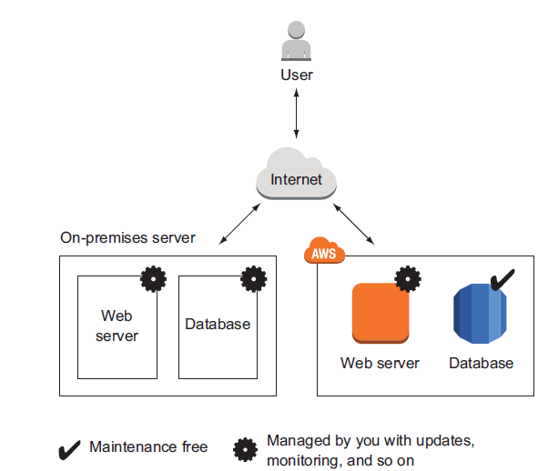

## Topic 1: AWS Overview
-----------------------------
```
This chapter covers
- Overview of AWS
- Benifits of using AWS.
- Example of what you can do with AWS.
- Creating and setting up an AWS account.
```
### 1. Cloud computing.

###### :+1: What is cloud computing?
Here's a more official definition from the National Institute of Standards and Technology:

>............
*Cloud computing is a model for enabling ubiquitous, convenient, on-demand network access to a shared pool of configurable computing resources (e.g., networks, servers,storage, applications, and services) that can be rapidly provisioned and released with minimal management effort or service provider interaction.*
                               :smile: —The NIST Definition of Cloud Computing,
                                 National Institute of Standards and Technology
............



###### :+1: Clouds are often divided into the following types:
- `Public`: A cloud managed by an organization and open to use by the general public.
- `Private`: A cloud that virtualizes and shares the IT infrastructure within a single
organization.
- `Hybird`: A mixture of a public and a private cloud.

###### :+1: Cloud computing services also have several classifications:
- `Infrastructure as a service (IaaS)`: Offers fundamental resources like computing,
storage, and networking capabilities, using virtual servers such as Amazon EC2,
Google Compute Engine, and Microsoft Azure virtual machines.
- `Platform as a service (PaaS)`: Provides platforms to deploy custom applications to
the cloud, such as AWS Elastic Beanstalk, Google App Engine, and Heroku.
- `Software as a service (SaaS)`: Combines infrastructure and software running in
the cloud, including office applications like Amazon WorkSpaces, Google Apps
for Work, and Microsoft Office 365

###### :tada: Note:
> - AWS is a public cloud
> - The AWS product portfolio contains IaaS, PaaS, and SaaS. Let’s take a more concrete look at what you can do with AWS. 


### 2. AWS overview.

###### :+1: What is AWS?
>............
*Amazon Web Services (AWS) is a secure cloud services platform, offering compute power, database storage, content delivery and other functionality to help businesses scale and grow. Explore how millions of customers are currently leveraging AWS cloud products and solutions to build sophisticated applications with increased flexibility, scalability and reliability.*
............

###### :+1: History.


###### :+1: What can we do with AWS?
You can run any application on AWS by using one or a combination of services.The examples in this section will give you an idea of what you can do with AWS.

_**Example 1:**_  Hosting the web shop.

.

_**Example 2:**_  Running a Java EE application in your private network.


_**Example 3:**_  Meeting legal and business data archival requirements Greg.

_**Example 4:**_  Implementing a fault-tolerant system architecture Alexa.

###### :+1: How you can benefit from using AWS?
What’s the most important advantage of using AWS? Cost savings, you might say. But
saving money isn’t the only advantage. Let’s look at other ways you can benefit from
using AWS.
>
- **_Easy to use_**:
AWS is designed to allow application providers, ISVs, and vendors to quickly and securely host your applications – whether an existing application or a new SaaS-based application. You can use the AWS Management Console or well-documented web services APIs to access AWS’s application hosting platform.

>
- **_Flexible_**:
AWS enables you to select the operating system, programming language, web application platform, database, and other services you need. With AWS, you receive a virtual environment that lets you load the software and services your application requires. This eases the migration process for existing applications while preserving options for building new solutions.

>
- **_Cost-Effective_**:
You pay only for the compute power, storage, and other resources you use, with no long-term contracts or up-front commitments. For more information on comparing the costs of other hosting alternatives with AWS, see the AWS Economics Center.

>
- **_Reliable_**:
With AWS, you take advantage of a scalable, reliable, and secure global computing infrastructure, the virtual backbone of Amazon.com’s multi-billion dollar online business that has been honed for over a decade.

>
- **_Scalable and high-performance_**:
Using AWS tools, Auto Scaling, and Elastic Load Balancing, your application can scale up or down based on demand. Backed by Amazon’s massive infrastructure, you have access to compute and storage resources when you need them.

>
- **_Secure._**:
AWS utilizes an end-to-end approach to secure and harden our infrastructure, including physical, operational, and software measures. For more information, see the AWS Security Center.


    


 


