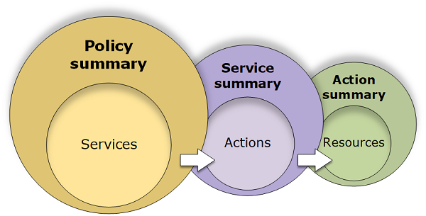

## Topic 2: IAM (Identity and Access Management )

```
This topic covers:
- What is IAM?
- Understanding how IAM works?


```

##### :dart:What is IAM?

  - The Identity and Access Management (IAM) service provides everything needed for
    authentication and authorization with the AWS API. Every request you make to the
    AWS API goes through IAM to check whether the request is allowed. IAM controls who
    (authentication) can do what (authorization) in your AWS account: who’s allowed to
    create EC2 instances? Is the user allowed to terminate a specific EC2 instance?
  - Authentication with IAM is done with users or roles, whereas authorization is done
    by policies. How do users and roles differ? Table bellow shows the differences. Roles
    authenticate an EC2 instance; a user should be used for everything else.

|                                        | Root user             | IAM user | IAM role |
| -------------------------------------- | --------------------- | -------- | -------- |
| Can have a password                    | Always                | Yes      | No       |
| Can have a access key                  | Yes (not recommended) | Yes      | No       |
| Can belong to a group                  | No                    | Yes      | No       |
| Can be associated with an EC2 instance | No                    | No       | Yes      |

​                                            	`Table: Difference between root user, IAM user, IAM role`

- IAM users and IAM roles use policies for authorization. Let’s look at policies first as we
  continue with users and roles. Keep in mind that users and roles can’t do anything
  until you allow certain actions with a policy.


##### :dart: Understanding how IAM works?

Before you create users, you should understand how IAM works. IAM provides the infrastructure
necessary to control authentication and authorization for your account. The IAM infrastructure includes
the following elements:

> - Terms
> - Principal.
>
> - Request.
> - Authentication.
> - Authorization.
> - Action or operations.
> - Resources.

 


###### :snowflake:Term

> - **Resources**: The user, role, group, and policy objects that are stored in IAM. As with other AWS services, you can add, edit, and remove resources from IAM
> - **Identities**: The IAM resource objects that are used to identify and group. These include users, groups, and roles.
> - **Entities**: The IAM resource objects that AWS uses for authentication. These include users and roles. Roles can be assumed by IAM users in your or another account as well as users federated through a web identity or SAML.
> - **Pricipals**: A person or application that uses an entity to sign in and make requests to AWS


###### :snowflake: Principal

>  A principal is a person or application that can make a request for an action or operation on an AWS resource.


###### :snowflake:Request.

When a principal tries to use the AWS Management Console, the AWS API, or the AWS CLI, that principal
sends a request to AWS. The request includes the following information:

> - **Actions or operations** – The actions or operations that the principal wants to perform. This can be an action in the AWS Management Console, or an operation in the AWS CLI or AWS API.
> - **Resources** – The AWS resource object upon which the actions or operations are performed.
> - **Principal** – The person or application that used an entity (user or role) to send the request.
>   Information about the principal includes the policies that are associated with the entity that the
>   principal used to sign in.
> - **Environment data** – Information about the IP address, user agent, SSL enabled status, or the time of day.
> - **Resource data** – Data related to the resource that is being requested. This can include information
>   such as a DynamoDB table name or a tag on an Amazon EC2 instance.


###### :snowflake:Authentication

As a principal, you must be authenticated (signed in to AWS) using an IAM entity to send a request to
AWS. Although some services, such as Amazon S3 and AWS STS, allow a few requests from anonymous
users, they are the exception to the rule.
To authenticate from the console as a user, you must sign in with your user name and password. To
authenticate from the API or AWS CLI, you must provide your access key and secret key. You might also
be required to provide additional security information. For example, AWS recommends that you use
multi-factor authentication (MFA) to increase the security of your account.

###### :snowflake:Authorization

###### :snowflake:Action and operations.

After your request has been authenticated and authorized, AWS approves the actions or operations in
your request. Operations are defined by a service, and include things that you can do to a resource, such
as viewing, creating, editing, and deleting that resource. For example, IAM supports approximately 40
actions for a user resource, including the following actions:

> - CreateUser
> - DeleteUser
> - GetUser
> - UpdateUser

You can find an overview of all the actions available for EC2 resources at http://mng.bz/WQ3D.

##### :snowflake:Resource.

After AWS approves the operations in your request, they can be performed on the related resources
within your account. A resource is an object that exists within a service. Examples include an Amazon
EC2 instance, an IAM user, and an Amazon S3 bucket. The service defines a set of actions that can be
performed on each resource. If you create a request to perform an unrelated action on a resource, that
request is denied. For example, if you request to delete an IAM role but provide an IAM group resource,
the request fails.

#### :dart: Overview of Identity Management.

##### :snowflake:Root User.

When you create an AWS account, you create an AWS account root user identity, which you use to sign in
to AWS. You can sign in to the AWS Management Console using this root user identity—that is, the email address and password that you provided when creating the account. This combination of your email
address and password is also called your root user credentials.

When you use your root user credentials, you have complete, unrestricted access to all resources in your
AWS account, including access to your billing information and the ability to change your password. This
level of access is necessary when you first set up your account. However, we recommend that you don't
use root user credentials for everyday access. We especially recommend that you do not share your root
user credentials with anyone, because doing so gives them unrestricted access to your account. It is not
possible to restrict the permissions that are granted to the root user.
The following sections explain how you can use IAM to create and manage user identity and permissions
to provide secure, limited access to your AWS resources, both for yourself and for others who need to
work with your AWS resources.

##### :snowflake: IAM Users

- The "identity" aspect of AWS Identity and Access Management (IAM) helps you with the question "Who is
  that user?", often referred to as authentication. Instead of sharing your root user credentials with others,
  you can create individual IAM users within your account that correspond to users in your organization.
  IAM users are not separate accounts; they are users within your account. Each user can have its own
  password for access to the AWS Management Console. You can also create an individual access key for
  each user so that the user can make programmatic requests to work with resources in your account. In
  the following figure, the users Li, Mateo, DevApp1, DevApp2, TestApp1, and TestApp2 have been added
  to a single AWS account. Each user has its own credentials.
- Notice that some of the users are actually applications (for example, DevApp1). An IAM user doesn't
  have to represent an actual person; you can create an IAM user in order to generate an access key for an application that runs in your corporate network and needs AWS access.
- We recommend that you create an IAM user for yourself and then assign yourself administrative
  permissions for your account. You can then sign in as that user to add more users as needed.

##### :snowflake: Federating Existing Users

If the users in your organization already have a way to be authenticated, such as by signing in to your
corporate network, you don't have to create separate IAM users for them. Instead, you can federate those
user identities into AWS.
The following diagram shows how a user can use IAM to get temporary AWS security credentials to
access resources in your AWS account.


  - **Policies and Accounts**

  - **Policies and Users**
    ```json
    {
      "Version": "2012-10-17",
      "Statement": {
        "Effect": "Allow",
        "Action": "dynamodb:*",
        "Resource": "arn:aws:dynamodb:us-east-2:123456789012:table/Books"
      }
    }
    ```
    + Policies are summarized in three tables: the [policy summary](https://docs.aws.amazon.com/IAM/latest/UserGuide/access_policies_understand-policy-summary.html), the [service summary](https://docs.aws.amazon.com/IAM/latest/UserGuide/access_policies_understand-service-summary.html), and the [action summary](https://docs.aws.amazon.com/IAM/latest/UserGuide/access_policies_understand-action-summary.html). The policy summary table includes a list of services. Choose a service there to see the service summary. This summary table includes a list of the actions and associated permissions for the chosen service. You can choose an action from that table to view the action summary. This table includes a list of resources and conditions for the chosen action
    
    
  - **Policies and Groups**

  - **Federated Users and Roles**: Federated users don't have permanent identities in your AWS account the way that IAM users do. To assign permissions to federated users, you can create an entity referred to as a role and define permissions for the role. When a federated user signs in to AWS, the user is associated with the role and is granted the permissions that are defined in the role

  - **Identity-based and Resource-based Policies**
    + Identity-based policies
      - Managed policies: AWS managed policies & Customer managed policies
      - Inline policies:
    + Resource-based policies: control what actions a specified principal can perform on that resource and under what conditions. Resource-based policies are inline policies, and there are no managed resource-based policies
###1.3 Security Features Outside of IAM
    
  - The user can access resource of AWS without IAM such as Amazon EC2, Amazon RDS, Amazon WorkSpaces, Amazon WorkDocs by key pair or username, password
  ##2. How to use?

  - AWS Management Console

  - AWS Command Line Tools

  - AWS SDKs

  - IAM HTTPS API

Note: [AWS Services That Work with IAM](https://docs.aws.amazon.com/IAM/latest/UserGuide/reference_aws-services-that-work-with-iam.html)
##3. Topics
##4. Practices
In this document, we will use [AWS Management Console](https://console.aws.amazon.com/iam/home#/home) to demo
- Firstly, you should create Administrator user


###Note:
- Don't use Root user for every tasks, just use to create first IAM users
- There are some tasks we need to use root user, please refer to [AWS Tasks That Require AWS Account Root User Credentials](https://docs.aws.amazon.com/general/latest/gr/aws_tasks-that-require-root.html)
- We should create an IAM user for yourself and then assign yourself administrative permissions for your account. You can then sign in as that user to add more users as needed
- Should add multi-factor authentication (MFA)
####References
[AWS IAM introduction](https://docs.aws.amazon.com/IAM/latest/UserGuide/introduction.html)