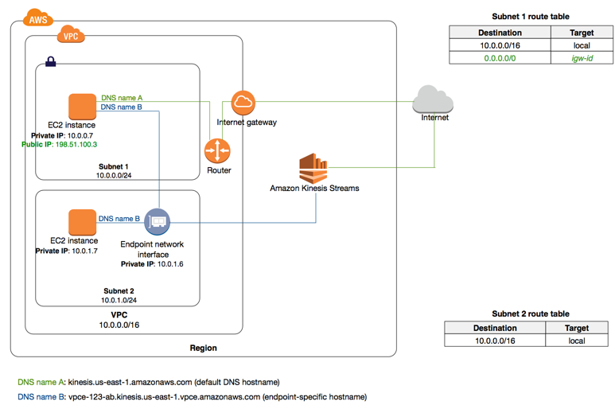

# Amazon Virtual Private Cloud (Amazon VPC) 

## What is Amazon Virtual Private Cloud?
- Amazon Virtual Private Cloud (Amazon VPC) enables you to launch Amazon Web Services (AWS) resources into a virtual network that you’ve defined. This virtual network closely resembles a traditional network that you’d operate in your own data center, with the benefits of using the scalable infrastructure of AWS.
- You can launch your AWS resources, such as Amazon EC2 instances, into your VPC.
- Your AWS resources are automatically provisioned in a ready-to-use default VPC. You can configure this VPC by adding or removing subnets, attaching network gateways, changing the default route table and modifying the network ACLs.
- You can choose to create additional VPCs by going to the Amazon VPC page in the AWS Management Console and selecting "Start VPC Wizard".

## What are the components of Amazon VPC?
Amazon VPC comprises a variety of objects that will be familiar to customers with existing networks:

- A Virtual Private Cloud: is a virtual network dedicated to your AWS account. It is logically isolated from other virtual networks in the AWS Cloud. You can launch your AWS resources, such as Amazon EC2 instances, into your VPC. You can specify an IP address range for the VPC, add subnets, associate security groups, and configure route tables.

  When you create a VPC, you must specify an IPv4 CIDR block for the VPC. The allowed block size is between a /16 netmask (65,536 IP addresses) and /28 netmask (16 IP addresses). After you've created your VPC, you can associate secondary CIDR blocks with the VPC. 

  

- Subnet:  is a range of IP addresses in your VPC. You can launch AWS resources into a specified subnet. Use a public subnet for resources that must be connected to the internet, and a private subnet for resources that won't be connected to the internet.
  - The CIDR block of a subnet can be the same as the CIDR block for the VPC (for a single subnet in the VPC), or a subset of the CIDR block for the VPC (for multiple subnets)
  - Subnet Routing: each subnet must be associated with a route table, which specifies the allowed routes for outbound traffic leaving the subnet. Every subnet that you create is automatically associated with the main route table for the VPC.
  - Subnet Security: each subnet must be associated with a network ACL. Every subnet that you create is automatically associated with the VPC's default network ACL.

- Internet Gateway: The Amazon VPC side of a connection to the public Internet.
- NAT Gateway: Network address translation (NAT) gateway is used to enable instances in a private subnet to connect to the internet or other AWS services, but prevent the internet from initiating a connection with those instances

- Peering Connection: A peering connection enables you to route traffic via private IP addresses between two peered VPCs.
  

- VPC Endpoints: Enables private connectivity to services hosted in AWS, from within your VPC without using an Internet Gateway, VPN, Network Address Translation (NAT) devices, or firewall proxies. Endpoints are virtual devices. There are two types of VPC endpoints: interface endpoints and gateway endpoints. Create the type of VPC endpoint required by the supported service.
  - An interface endpoint is an elastic network interface with a private IP address that serves as an entry point for traffic destined to a supported service. 
  
  - A gateway endpoint is a gateway that is a target for a specified route in your route table, used for traffic destined to a supported AWS service.
  

- Egress-only Internet Gateway: A stateful gateway to provide egress only access for IPv6 traffic from the VPC to the Internet (that allows outbound communication over IPv6 from instances in your VPC to the Internet, and prevents the Internet from initiating an IPv6 connection with your instances.)
  

- Elastic IP Addresses: is a static, public IPv4 address designed for dynamic cloud computing. You can associate an Elastic IP address with any instance or network interface for any VPC in your account. With an Elastic IP address, you can mask the failure of an instance by rapidly remapping the address to another instance in your VPC (the advantage of associating the Elastic IP address with the network interface instead of directly with the instance is that you can move all the attributes of the network interface from one instance to another in a single step)

- Security: AWS provides two features that you can use to increase security in your VPC: security groups and network ACLs. 
   - Security groups control inbound and outbound traffic for your instances
   - Network ACLs is an optional layer of security for your VPC that acts as a firewall for controlling  inbound and outbound traffic for your subnets (a optional layer of security for your VPC that acts as a firewall)

- Virtual Private Network (VPN)
  - Create Customer Gateway: Specify the Internet-routable IP address for your gateway's external interface.
  - Virtual private gateway: The Amazon VPC side of a VPN connection.
  - Site-to-site VPN Connections: Mapping the virtual private gateway and customer gateway that you would like to connect via a VPN connection. 

## Scenarios and Examples
### Scenario 1: VPC with a Single Public Subnet
- Your instances run in a private, isolated section of the AWS cloud with direct access to the Internet. Network access control lists and security groups can be used to provide strict control over inbound and outbound network traffic to your instances.

- Creates: A /16 network (VPC) with a /24 subnet. Public subnet instances use Elastic IPs or Public IPs to access the Internet.

  

### Scenario 2: VPC with Public and Private Subnets (NAT)
- In addition to containing a public subnet, this configuration adds a private subnet whose instances are not addressable from the Internet. Instances in the private subnet can establish outbound connections to the Internet via the public subnet using Network Address Translation (NAT).
- Creates: A /16 network (VPC) with two /24 subnets. Public subnet instances use Elastic IPs to access the Internet. Private subnet instances access the Internet via Network Address Translation (NAT). (Hourly charges for NAT devices apply.)

  

### Scenario 3: VPC with Public and Private Subnets and AWS Site-to-Site VPN Access
- This configuration adds an IPsec Virtual Private Network (VPN) connection between your Amazon VPC and your data center - effectively extending your data center to the cloud while also providing direct access to the Internet for public subnet instances in your Amazon VPC.
- Creates: A /16 network with two /24 subnets. One subnet is directly connected to the Internet while the other subnet is connected to your corporate network via IPsec VPN tunnel. (VPN charges apply.)

  

### Scenario 4: VPC with a Private Subnet Only and AWS Site-to-Site VPN Access
- Your instances run in a private, isolated section of the AWS cloud with a private subnet whose instances are not addressable from the Internet. You can connect this private subnet to your corporate data center via an IPsec Virtual Private Network (VPN) tunnel.
- Creates: A /16 network with a /24 subnet and provisions an IPsec VPN tunnel between your Amazon VPC and your corporate network. (VPN charges apply.)

  